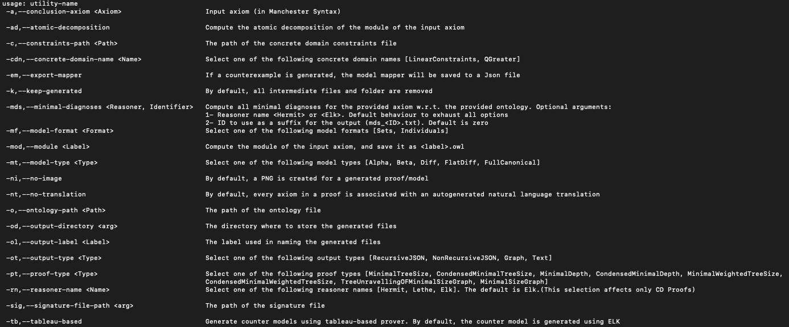

----

#### Table of contents
- [Description](#description)
- [Getting Started](#getting-started)
- [EL Proofs](#proofs)
- [EL Counterexamples](#counterexamples)
- [Diagnoses](#diagnoses)
- [Atomic Decomposition](#atomic-decomposition)
- [Concrete Domains Proofs](#concrete-domains-proofs)
- [Proof Rewriting](#proof-rewriting)
- [Evonne](#evonne)

----

### Description

In general, **EL Explicator** is a tool for generating explanations for Description Logic reasoning. It generates explanations for *logical consequences* and *non-consequences* of DL ontologies. Additionally, it can be used to debugging *unwanted consequences* and more. While *EL* is the primary DL it focuses on, the tool also extends to other logics for specific features, which are specified in their corresponding sections.

--

### Getting Started
To build **EL Explicator**, you first need to clone [Evee](https://github.com/de-tu-dresden-inf-lat/evee/tree/main), 

```
git clone https://github.com/de-tu-dresden-inf-lat/evee --recurse-submodules
```

and then install it locally. Run the following in `evee/` 

```
mvn clean install 
```

Additionally, **EL Explicator** depends on two other projects ( *CD Reasoner* and *Graph Generator* ), which are not published yet. Currently, the needed jar files are provided under `lib/`, which need to be installed in a local repository for this project. To do so, go to `elExplicator/` and run

```
mvn install:install-file -Dfile=./lib/graphGenerator-owlapi4-0.1-SNAPSHOT.jar \
-DgroupId=de.tu-dresden.inf.lat \
-DartifactId=graphGenerator-owlapi4 \
-Dversion=0.1-SNAPSHOT \
-Dpackaging=jar \
-DlocalRepositoryPath=repo
```
to install *Graph Generator*, and then run 

```
mvn install:install-file -Dfile=./lib/concrete-domain-reasoner_2.12-0.1.0-SNAPSHOT.jar \
-DgroupId=de.tu-dresden.inf.lat \
-DartifactId=concrete-domain-reasoner_2.12 \
-Dversion=0.1-SNAPSHOT \
-Dpackaging=jar \
-DlocalRepositoryPath=repo
```
to install *CD Reasoner*. Now you have all dependencies ready and you can build **EL Explicator** by running the following command in 

```
mvn clean compile assembly:single

``` 

This creates "ELExplicator.jar" which can be found in `target/`. To check if jar file was created successfully, run the following command

```
java -jar ./target/ELExplicator.jar
```

and you should get something like this

<p align="center">
	<kbd align="center">
	  
	</kbd>
</p>

Lastly, to be able to use the *Diagnoses* feature, you need to install *Clingo*. you can either run 
```
brew install clingo
```
or follow the instruction provided on the website of [Clingo](https://potassco.org/clingo/).

--

### EL Proofs
//TODO

--

### EL Counterexamples
//TODO

--

### Diagnoses
**EL Explicator** can compute all minimal diagnoses of a given axiom using a modified version of [INCA](https://github.com/lukeswissman/inca), which is a tool for navigating answer sets of logic programs. In short, **EL Explicator** computes all the justifications for a given axiom, then encodes them as rules in a logic program that *INCA* then uses to compute all answer sets containing all minimal diagnoses. **EL Explicator** translates and filters the results and writes them to a text file. Diagnoses are separated by `\n` and axioms by `;`. For example, to compute all diagnoses of `SpicyIceCream SubClassOf: owl:Nothing`, you can run the following command:

```
java -jar ./target/ELExplicator.jar \
-a "<http://subPizza#SpicyIceCream> SubClassOf: owl:Nothing" \
-o ./src/test/resources/ontologies/modifiedPizzaOntology.owl \
-mds ELK, d1 \
-od ./minimalDiagnoses

```
which uses the reasoner *ELK* to compute the justifications and write the diagnoses to a file labeled `minimalDiagnoses/mDs_d1.txt`.

This feature supports DLs up to SROIQ and can utilise two reasoners: *ELK* and *Hermit*.

--

### Atomic Decompositions
**EL Explicator** can compute an atomic decomposition based on the notion of star modules. For example, the following command: 

```
java -jar ./target/ELExplicator.jar \
-a "<http://subPizza#SpicyIceCream> SubClassOf: owl:Nothing" \
-o ./src/test/resources/ontologies/modifiedPizzaOntology.owl \
-ad \
-ol aD1

```

extracts a module of the signature of `SpicyIceCream SubClassOf: owl:Nothing` from the input ontology and uses it to generate the atomic decomposition, which is then exported to `defaultOutputFolder/aD1.JSON` and `defaultOutputFolder/aD1.XML`.

--

### Concrete Domains Proofs
//TODO

--

### Proof Rewriting
//TODO

--

### Evonne
//TODO


